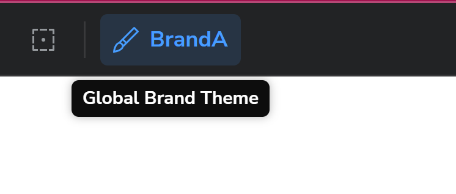

# Biglight Frontend Developer Challenge

## Getting started

1. Clone the repo:

   ```bash
   git clone https://github.com/AFOJ/biglight-fe-test.git
   ```

2. Change to the project directory:

   ```bash
   cd biglight-fe-test
   ```

3. Install dependencies:

   ```bash
   npm install
   ```

4. Run Storybook:

   ```bash
   npm run storybook
   ```

   Then visit http://localhost:6006/

5. Build Storybook:

   ```bash
   npm run storybook:build
   ```

## Themes

### Switching Themes

**In App** To apply a theme to an area, add the `data-theme={your-target-theme}` attribute to a wrapper element.

**In Storybook** Use the "Themes" (paintbrush icon) in the toolbar to switch brands globally.



### Generating Theme variables

To generate new theme variables:

```bash
npm run figma-tokens:extract
```

Then copy the content of the generated css in `script/token.css` into `src/global.css`.

## Time Taken

≈ 7 Hours
